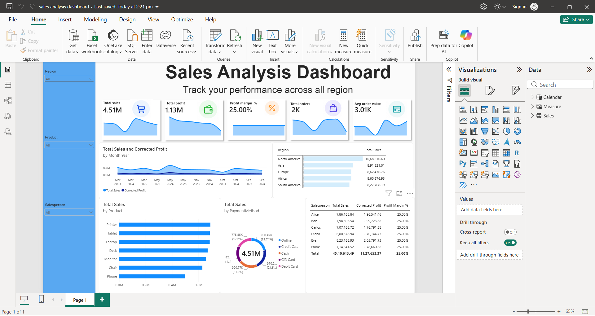

# Sales Analysis Dashboard (Power BI)

An interactive Power BI dashboard to track sales performance across regions, products, salespersons and payment methods.



## Key Metrics
- Total Sales: 4.51M
- Total Profit: 1.13M (estimated at 25% margin)
- Total Orders: 2K
- Average Order Value: 3.01K

## Insights
- North America is the top region by sales, followed by Asia and Europe
- Printer, Tablet and Laptop lead product-wise sales
- Payment methods are almost evenly split (~17-22% each)
- Sales show a steady trend from Mar 2023 to Sep 2024

## Data Cleaning & Correction
- Created a **Corrected Profit** measure using DAX, with profit estimated as a fixed 25% margin on Total Sales (assumption)
- All profit visuals use Corrected Profit
- Because the margin is an assumed constant, Profit Margin % is 25% across all salespersons

```DAX
Corrected Profit = SUM(Sales[Total Sales]) * 0.25
```

## Features
- Slicers for Region, Product and Salesperson
- KPI cards, monthly trend, region/product/payment charts, salesperson table

## Tools Used
Power BI Desktop, DAX, Power Query

## Files
- `Sales Analysis Dashboard.pbix` - Power BI file
- `dashboard.png` - dashboard preview
- dataset file - raw data
